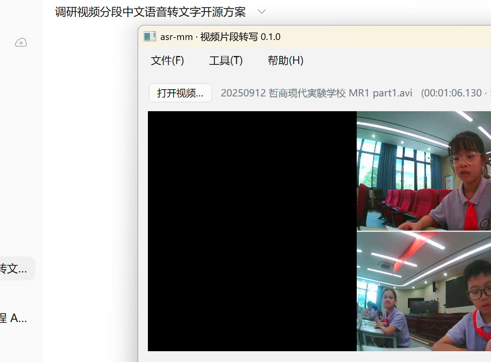
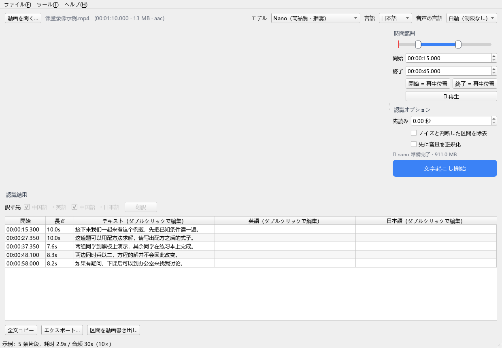
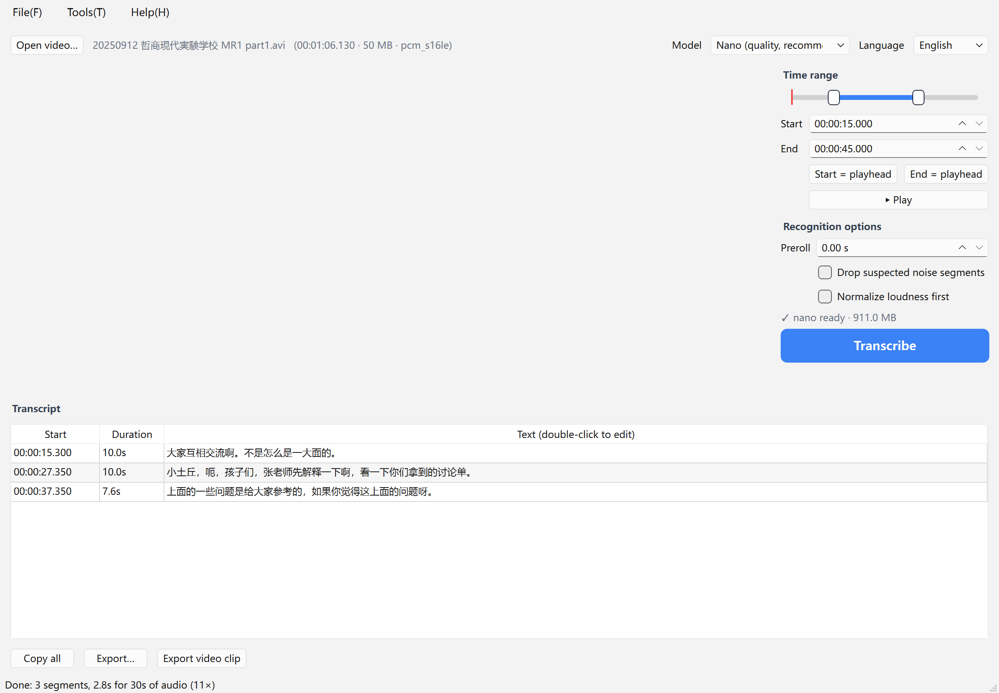
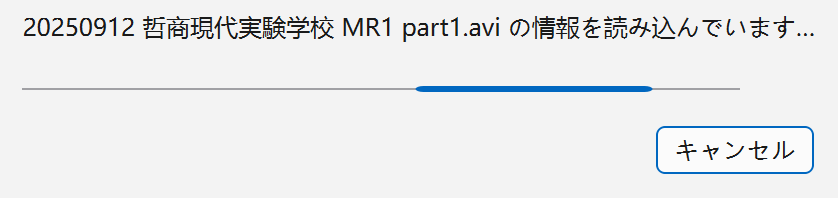

# asr-mm

**视频指定时间段 → 中文语音转写。** 全程本地离线，不上传任何音频。

给一个视频，挑出其中几分几秒到几分几秒，把这段话变成文字。



界面支持 **简体中文 / English / 日本語**，可在右上角切换或用 `asr-mm --lang ja` 指定。
转写结果的语言始终由音频内容决定（当前引擎面向中文语音），与界面语言无关。

| 日本語 | English |
|---|---|
|  |  |

---

## 为什么这么做

现成工具（如 [FunClip](https://github.com/modelscope/FunClip)）都是**先识别整段视频，再从结果里选片段**。
如果要处理的是两小时的长视频，只想转其中 60 秒，却得等十几分钟。

asr-mm 反过来做：先用 ffmpeg 精确截取你指定的那一小段，再喂给识别引擎。
**实测截取识别与全片识别在同一区间的文字逐字一致**（见下方「验证」），所以没有理由先转整段。

---

## 效果实测

素材：真实课堂录像 `课堂录像示例.mp4`
（66 秒，MJPEG 640×480，PCM 22050Hz 单声道，**多人交替说话、有背景噪音**）

选区 `00:00:15 – 00:00:45`，Nano 模型，**耗时 2.8 秒（11× 实时）**：

```
00:00:15.300 --> 00:00:25.300
（课堂内容，略）

00:00:27.350 --> 00:00:37.350
（课堂内容，略）

00:00:37.350 --> 00:00:44.980
（课堂内容，略）
```

三模型同片段对比（`00:10.7 – 00:20.7`）：

| 模型 | 输出 |
|---|---|
| **Nano** | （课堂内容，略） |
| Paraformer | （课堂内容，略）（无标点） |
| SenseVoice | （课堂内容，略） |

SenseVoice 把「同步」听成「投诉」、「之间」听成「时间」，并且在 1 秒以内的短片段上会输出空内容或 `Yeah.`。

---

## 安装

### 图形界面

1. 下载 `asr-mm-gui` 压缩包，解压后双击 `asr-mm-gui.exe`（macOS 见下）
2. 首次使用点「工具 → 下载缺失模型」，选 Nano（约 911 MB）或 Paraformer（约 228 MB）
3. 拖入视频，拖动时间轴选择区间，点「开始转写」

**不需要预装 Python 或 ffmpeg**，两者都已打包在程序里。

### macOS：首次运行需要多一步

从 GitHub 下载的压缩包会被 macOS 标记为「已隔离」（quarantine）。
未签名的程序在带标记状态下不允许加载自己的动态库，PyInstaller 打包的产物里
全是 dylib，所以直接双击会报：

```
Failed to load Python shared library '.../_internal/Python':
  ... not valid for use in process: library load disallowed by system policy
```

两种解法，任选其一：

- **解压后双击 `Open asr-mm.command`** —— 它会自动清除隔离标记再启动，之后
  直接双击 `asr-mm-gui` 即可。压缩包里还有 `README-macOS.txt`（中英日）。
- **手动执行一次**：

  ```bash
  xattr -cr ~/Downloads/asr-mm-gui
  ./asr-mm-gui/asr-mm-gui
  ```

- 或者在 Finder 里**右键 → 打开**（不是双击），再点「打开」。

想要彻底免去这一步需要 Apple 开发者账号做签名公证，
配置方式见 [docs/NOTARIZATION.md](docs/NOTARIZATION.md)。

### 命令行

```bash
asr-mm setup                 # 装运行时 + 下载模型（仅首次）
asr-mm doctor 视频.mp4        # 环境自检

asr-mm transcribe 视频.mp4                          # 整段
asr-mm transcribe 视频.mp4 -s 00:03:20 -e 00:05:10  # 指定区间
asr-mm transcribe 视频.mp4 -s 200 -e 310 -m paraformer
asr-mm transcribe 视频.mp4 --stdout --output-format srt | clip   # 管道

asr-mm --lang ja models list                        # 界面语言
asr-mm --lang en doctor 视频.mp4
```

时间码支持 `HH:MM:SS.zzz` / `MM:SS` / 纯秒数。
界面语言默认跟随系统（Windows 读系统 UI 语言，macOS/Linux 读 `LC_ALL`/`LANG`），GUI 里的选择会记住。

### 从源码运行

```bash
pip install -e ".[dev]"
python -m asr_mm setup
python -m asr_mm.gui            # 图形界面
python -m asr_mm transcribe v.mp4 -s 00:03:20 -e 00:05:10
```

### 自己构建

```bash
pip install pyinstaller imageio-ffmpeg
python packaging/prepare_payload.py --target win    # 或 mac / linux
python -m PyInstaller packaging/asr-mm.spec --noconfirm --workpath .pyinstaller-cache
```

> **成品在 `dist/` 里。**
> `dist/asr-mm/asr-mm.exe`（命令行）和 `dist/asr-mm-gui/asr-mm-gui.exe`（图形界面）
> 才是可运行的程序，下载 release 也是解压这个结构。
>
> **不要运行构建缓存里的 exe。** PyInstaller 默认把中间产物写进 `build/`，
> 那里只有 exe 本体和 `.pkg` 归档，`_internal/`（含 `python311.dll`、ffmpeg、
> 识别引擎）要到 COLLECT 阶段才会写进 `dist/`。直接双击 `build/` 里的 exe 会报：
>
> ```
> Failed to load Python DLL
> '...build\asr-mm\_internal\python311.dll'. LoadLibrary: 找不到指定的模块。
> ```
>
> 上面命令用 `--workpath .pyinstaller-cache` 就是为了避免这个歧义。
> 若你用的是默认 `build/`，构建结束后可以直接删掉它。

---

## 三档模型

在 Phase 0 用同一段真实录音横向实测（纯 CPU，16 核）：

| 模型 | 体积 | 66s 音频耗时 | 标点 | GPU | 特点 |
|---|---|---|---|---|---|
| **Nano** | 911 MB | 6.6s（10×） | ✅ | 仅 CPU | 准确率最高，标点完整。**默认** |
| Paraformer | 228 MB | 2.3s（29×） | ❌ | 仅 CPU | 最快最小，适合快速浏览 |
| SenseVoice | 244 MB | 2.8s（23×） | ✅ | ✅ CUDA/Vulkan | 唯一支持显卡加速 |

均为 MIT 许可，可商用。模型在首次使用时从 HuggingFace 下载并缓存到本地，之后可完全离线。

### 关于 Whisper

**没有用 Whisper tiny** —— 中文场景下它不够用：训练数据里中文只占约 12%，tiny 仅 39M 参数，
独立测试中同类小模型完全正确率仅 16.5%，且伴随重复生成、长句截断、繁简乱切。
在 SNR=10dB 的咖啡厅噪音下，Whisper 的 CER 会从 3% 恶化到 9.7%。
本项目默认模型在同一测试集上完全正确率为 46.5%。

---

## 使用中的几个要点

**时间戳是「句段级」而非「字级」。** 底层引擎给出的是 VAD 语音分段边界，
所以字幕是按 10 秒左右的自然停顿切分，不是每个字一个时间点。
需要字级时间戳要换用 FunASR Python 方案，代价是安装包从 ~300MB 涨到 2GB+。

**`--maxseg` 默认锁死 10000 毫秒。** 这不是随便定的：Nano 基于 LLM 解码器，
在长噪声段上会退化成复读（「大哥大哥。大哥。大哥。大哥。…」），
把分段上限压到 10 秒可以完全避免。命令行可以调，但调大会看到复读。

**疑似噪音片段只标记、不默认删除。** 纯噪音会被模型「幻听」成短词，
这类结果在表格里标黄，JSON 里 `suspicious: true`。
勾选「过滤疑似噪音片段」或 `--drop-short` 才会真正丢弃。

**网络设置（下载模型失败时先看这里）**

模型从 Hugging Face 或 ModelScope 下载。两个源都指向同一批文件（已核对体积一致），
默认先用 Hugging Face，失败自动切到 ModelScope。

若下载时报 `CERTIFICATE_VERIFY_FAILED`：

1. 打开「工具 → 网络设置」，点「**测试连接**」
2. 诊断会显示证书的**签发者**。如果看到的是公司设备的名字
   （Zscaler / Palo Alto / Fortinet /  naked 社用网关等），
   说明网络在解密 TLS——浏览器能访问是因为系统钥匙串里有那张根证书。
3. 三种应对：
   - 下载该网关的根证书，在「公司根证书文件」里指定它
   - 改用「仅 ModelScope」下载源
   - 实在拿不到根证书，才勾选「跳过 TLS 校验」

命令行同样可以诊断：

```bash
asr-mm net-check                    # 逐个源测试并显示签发者
asr-mm net-check --mirror modelscope
```

> **为什么打包后需要这些？** macOS 的 Python 从框架目录读 `cert.pem`，
> PyInstaller 不会把那个文件带进包里，结果是 CA 存储为空、**任何** HTTPS 都失败。
> 因此本程序固定打包 `certifi` 的根证书，并用 `truststore` 读取系统钥匙串——
> 后者正是公司根证书所在的地方。

**降噪不是重点，VAD 才是。** 比起给整段带噪音频做降噪，先用 VAD 切掉静音和纯环境音
收益更大。所以默认不做降噪，只提供可选的响度归一化。

**加载视频不会卡死。** 读取文件信息和解码预览画面都在后台线程完成，
期间弹窗显示进度并可随时取消：



探测阶段进度条是不确定态的转动动画（此时没有可信的百分比，
一根卡在 2% 的进度条和卡死没区别）；解码阶段切换为真实百分比，
由 ffmpeg 的 `-progress` 驱动。快速加载（本地小文件约 200ms）不会闪现弹窗，
慢速加载（网络盘、大文件）才会出现。首帧画面会在播放器接管前先显示出来。

> 注：Qt 6 / PySide6 的 `QProgressDialog.cancel()` 并**不会**触发 `canceled()`
> 信号（实测确认），所以取消逻辑重写了 `cancel()` 来拦截，否则取消按钮形同虚设。

**暂不支持说话人分离。** 底层 llama.cpp 运行时没有实现 CAM++，
所以「谁在说」需要走 FunASR Python 管线。这是已知的取舍。

**日文/中文 Windows 上的路径问题已处理。** llama.cpp 的 GGUF 加载器用窄字符
`fopen` 打开模型，路径里的非 ASCII 字符会按系统 ANSI 代码页解释，
在 CP932（日文 Windows）下 `C:\Users\日本語\...` 会导致模型**加载失败**。
因此当用户目录含非 ASCII 字符时，模型会被**硬链接**到同卷的纯 ASCII 目录
（`%PUBLIC%\asr-mm\models` 等，优先与用户目录同盘以避免拷贝），不额外占用磁盘。
已实测：中文/日文/西里尔/emoji/含空格文件名、日文目录下的音频路径、
中文/日文目录下的可执行文件路径全部通过。

其它编码点：所有文件读写显式 UTF-8，子进程输出按 UTF-8 解码，
控制台在非 UTF-8 代码页下会被强制切到 UTF-8，Qt 本身是 Unicode 原生。

---

## 架构

```
视频 ──ffmpeg 截取──▶ 16kHz 单声道 WAV ──llama.cpp 二进制──▶ SRT(stdout)
                                                    │
                                          VAD 分段 + 时间戳回算 + 噪音标记
                                                    │
                                        txt / srt / json / 视频片段
```

```
asr_mm/
  catalog.py     模型与运行时清单（URL、体积、SHA256、镜像）
  net.py         HTTPS：镜像回退、证书信任、错误分类、网络诊断
  settings.py    持久化偏好（语言、下载源、根证书）
  paths.py       只读资源目录 vs 用户可写目录
  downloader.py  断点续传 + 校验 + 原子替换
  media.py       ffmpeg 封装：探测、抽音频、抽帧、切片
  srt.py         SRT 解析与渲染
  engine.py      调 llama.cpp 二进制
  transcribe.py  编排：区间校验 → 抽音频 → 识别 → 回算时间戳
  i18n.py        zh/en/ja 词条与语言检测
  cli.py         命令行
  gui/           PySide6 界面
packaging/       PyInstaller 打包、macOS 签名公证、发布归档
```

**不打包 Python ML 框架。** 识别交给 FunASR 官方预编译的 llama.cpp 二进制
（Windows 5MB / macOS 7MB），Python 侧只做编排，因此安装包约 300MB
而不是 2GB。模型按需下载，不进安装包。

---

## 验证

```bash
python -m pytest tests/ -q          # 27 项单元测试
python tools/e2e_test.py            # 11 项端到端（需已下载模型）
```

已验证：环境自检 / 模型清单 / 区间截取 / 数字与字符串时间码 / 预读偏移 /
整段转写 / 快速模型 / 噪音过滤 / stdout 管道 / 粗细 VAD 分段 /
时间码越界、顺序颠倒、文件不存在三种报错路径。

---

## 许可与来源

代码 MIT（见 [LICENSE](LICENSE)）。以下第三方组件各有独立许可，随程序分发或运行时下载：

- 识别引擎：[modelscope/FunASR](https://github.com/modelscope/FunASR) llama.cpp 运行时，MIT
- 模型：Fun-ASR-Nano / Paraformer / SenseVoice / FSMN-VAD，均为 MIT
- 解码器：FFmpeg（LGPL v2.1+，随 `imageio-ffmpeg` 分发的静态构建）
- 界面：PySide6 / Qt 6（LGPL v3）

模型权重不随仓库分发，运行时从 HuggingFace 下载并做体积校验。
